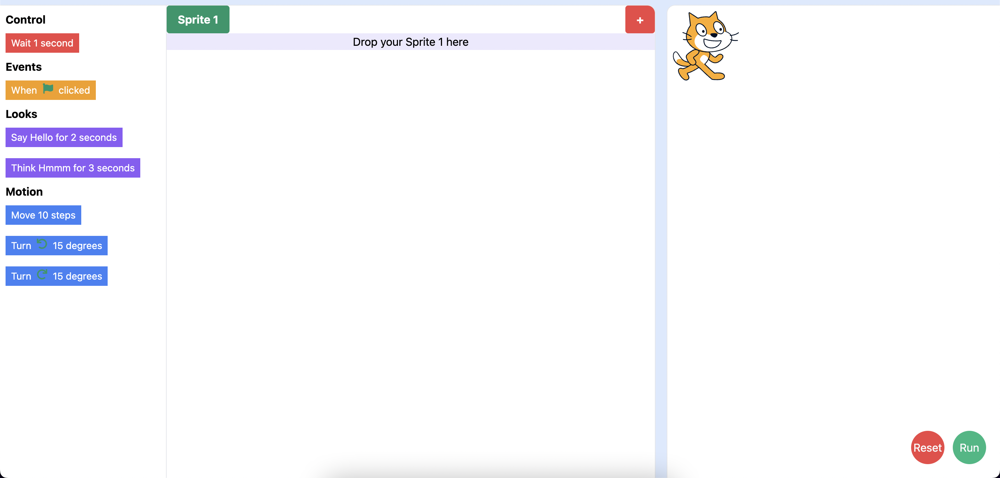

# Scratch MIT 3.0

> Designed and implemented a production ready application

> Technology used: `React 17` , `Tailwind css`

> Live application can be accessed from : [Live-Demo](https://fayez-scratch-mit.vercel.app/)

---

## Table of Contents

- [Installation](#installation)
- [Features](#features)
- [Screenshots](#Screenshots)
- [BrowserList](#browserlist)

---

## Installation

> To proceed with smooth installation you should have Node 8+ version installed in your system

> Please navigate to `scratch-mit` folder and run below command to install `node_modules` in order to run this app locally.

```shell
$ npm install
```

> Once node dependencies are installed then please open `command prompt` and run `npm start` for a development server.
> Navigate to `http://localhost:3000/`.
> The app will automatically reload if you change any of the source files.

> Alternatively, Please have a look on [Live-Demo](https://fayez-scratch-mit.vercel.app/)

---

## Features

> Expected functionality:

- Build the 4 categories of blocks ‘Motion’, ‘Looks’, ‘Control’ and ‘Events’ and the corresponding functionalities (All drag drop functionalities as reflected in the Scratch app should be covered)
- Add support for creating multiple ‘Sprites’ and make actions from Feature1 available for multiple ‘Sprites’

## Screenshots

> Index Page



## BrowserList

> Best user experience can be enjoyed on:

- Google Chrome
- Mozilla Firefox
- Safari
- Microsoft Edge

---
